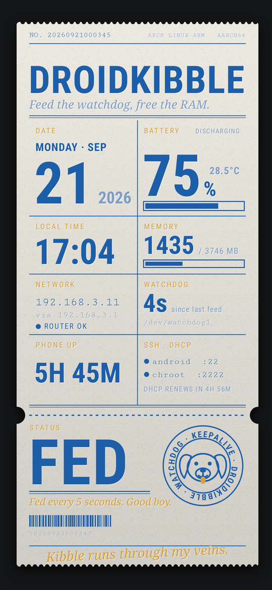
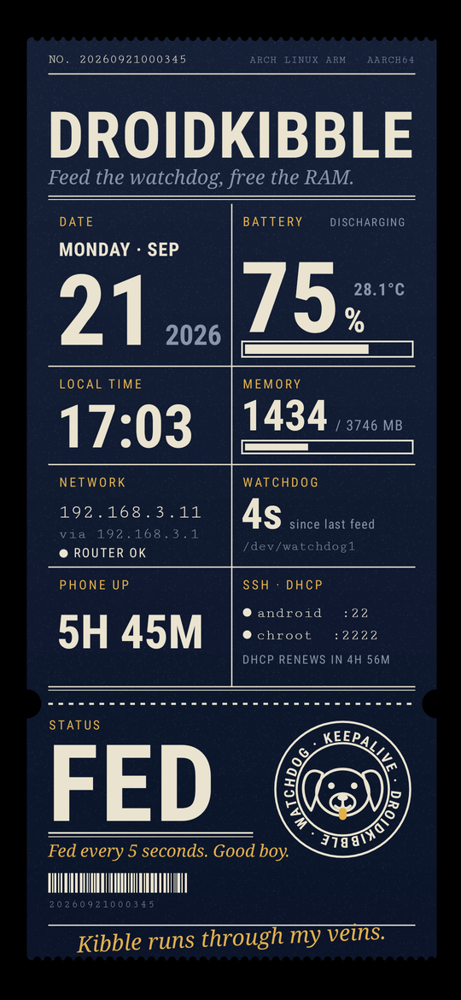

# display: the on-screen status

While the Android UI is off, this draws the phone's status on the screen. It's a small Java program that runs under `app_process` and paints through SurfaceFlinger, which keeps running in headless mode. No `system_server`, no kernel display code. How I got here, and what I ruled out, is in [docs/how-it-works.md](../docs/how-it-works.md#drawing-on-the-screen).

| paper theme | night theme |
|---|---|
|  |  |

The look is a letterpress ticket: a ruled grid on the body, a perforation, and a stub whose big word says how the watchdog is doing (FED, HUNGRY or LOST). The paper theme is cream and blue with gold accents. The night theme is cream on navy over pure black, which suits an AMOLED panel, since black pixels are off.

## Status

Checked on the Galaxy A30: it starts, both themes render correctly in a `screencap` of SurfaceFlinger's output, and it redraws every few seconds. An earlier plain-text version of the same approach was seen on the physical panel; the ticket page itself hasn't been looked at on the panel yet. It uses about 100 MB of RAM while running.

`phoneserverd` starts and stops it: the power button toggles the screen, it turns itself off after a timeout, and `ui.sh on` cleans it up. Checked on the phone with a real daemon: a (simulated) power press lights it, a second turns it off, the auto-off timer works, killing the program by hand makes the daemon turn the screen off, and `ui.sh on` with the screen lit leaves nothing behind. See [docs/daemon.md](../docs/daemon.md#the-screen-and-the-power-button). Not measured: battery cost, or a run of many hours.

## Installing

```sh
scripts/pc/get-display-tools.sh      # once: JDK 17, d8 and android.jar into ~/.local/droidkibble-sdk (about 260 MB)
display/build.sh                     # makes display/build/status.jar
scripts/pc/install.sh <ssh-host>     # copies status.jar and run.sh to /data/adb/phoneserver/display/
scripts/pc/build-daemon.sh <ssh-host>   # the daemon (0.2 or newer) is what reads the power button
```

Then go headless (`ui.sh off`) and press the power button. Settings (theme, brightness, timeout) are in `display.conf`; see [docs/daemon.md](../docs/daemon.md#the-screen-and-the-power-button).

## Running it by hand

```sh
scp display/build/status.jar display/run.sh phone-root:/data/local/tmp/     # or anywhere next to each other
ssh phone-root 'sh /data/local/tmp/run.sh --theme night --seconds 60'
```

`run.sh` raises the backlight (`BRIGHTNESS`, default 120 of 365) and puts it back to 0 when the program exits. Leave out `--seconds` to run until you stop it. Options for the program itself: `--theme paper|night`, `--interval SECONDS` (default 5), `--status FILE`, `--extras DIR`.

To see what's on the screen without looking at the phone, take a screenshot of what SurfaceFlinger composes: `ssh phone-root screencap -p /data/local/tmp/shot.png`.

## How it's put together

The code is a small framework so that more information can be added without rewriting the drawing.

| file | what it does |
|---|---|
| `Status.java` | the main program: makes the layer, then loops: refresh the data, draw the current page. It also moves the picture a few pixels every few minutes so nothing stays on the same pixels for days. |
| `Page.java` | the interface a screen implements: `name()` and `draw(ctx)`. With more than one page they take turns every 20 seconds. |
| `Data.java` | the data pages read from. `status.json` is the root. Every other `*.json` file in the extras directory (`/data/adb/phoneserver/display.d/`) is added under its file name. Lookups are dotted paths and never throw. |
| `Theme.java` | colors and typefaces. A new look is a new theme. |
| `Ui.java` | the toolkit: letterpress text, fitted text, rules, bars, dots, the scalloped ticket outline, paper grain, the round stamp with a dog in it, barcodes. |
| `TicketPage.java` | the ticket. Use it as the example for a new page. |

### Showing more information later

To show something from another program, have it write a JSON file into `display.d/`. For example a file `nodhd.json` containing `{"tasks_today": 3}` is read as `nodhd.tasks_today`:

```java
int n = (int) ctx.data.num("nodhd.tasks_today", 0);
```

Then either add a cell to the ticket or write a new `Page`, add it to the list in `Status.java`, and rebuild.

### Things to know

- The screen is 1080 by 2340 and the layout uses those numbers directly. Another phone would need them changed.
- It uses two hidden Android APIs through reflection (`Transaction.setLayerStack`). That worked on Android 11; other versions may differ.
- It needs a font set like the Galaxy A30's: `sans-serif-condensed`, `serif` italic, and `serif-monospace`.
